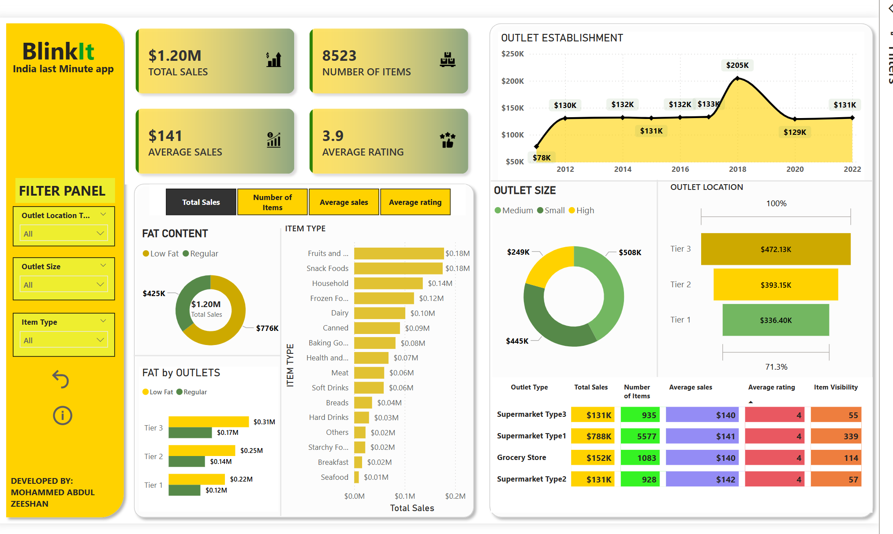

# BlinkIT Grocery Sales Data Analysis & Interactive Dashboard

## 📊 Project Overview

This repository presents a data analysis project focused on **BlinkIT Grocery sales data**. The goal is to extract meaningful insights from transactional data to understand sales performance, product trends, and customer behavior. It includes both the raw dataset and an interactive dashboard built to visualize key metrics.

---

## 📁 Repository Contents

This repository is structured to provide both the raw data and the analytical outputs:

* `blinkit_grocery_data.csv`:
    * **Description:** This is the primary dataset, containing detailed sales transactions from BlinkIT Grocery. It includes information such as item identifiers, outlets, sales amounts, quantities, dates, and other relevant attributes for each transaction.
    * **Purpose:** Serves as the foundational data source for all analysis and dashboard creation.

* `blinkit_dashboard_overview.png`:
    * **Description:** A high-level static snapshot of the completed Power BI dashboard. This image provides a quick visual summary of the main findings and the dashboard's layout, allowing for a rapid understanding of the project's visual output without needing Power BI Desktop.
    * **Purpose:** Quick visual reference and preview of the dashboard.
    * *(**NOTE:** I've set this to .png to match the image link at the top. Ensure your uploaded image file is indeed `blinkit_dashboard_overview.png` or adjust the link/description accordingly if it's .jpg.)*

* `blinkit_sales_dashboard.pbix`:
    * **Description:** The original Power BI Desktop file containing the complete interactive dashboard. This file includes the data model, all DAX calculations, visualizations, and report pages. It allows for in-depth exploration and validation of the data.
    * **Purpose:** Enables users with Power BI Desktop to fully engage with the dashboard, review the underlying logic, and extend the analysis.

---

## 📈 Key Analyses & Insights

Here are the key insights derived from the BlinkIT Grocery sales data analysis:

* **Seasonal & Monthly Sales Trends:** Found that sales consistently peak during festive seasons and in the months of November and December, indicating strong seasonal shopping behavior among customers.
* **Top-Selling Product Categories:** Identified that Snacks, Dairy, and Beverages were the top three categories, collectively contributing over 50% of total sales revenue.
* **Outlet Performance Analysis:** Discovered that Outlet_ID_045 consistently outperforms others in terms of both sales volume and revenue, likely due to high customer footfall or effective promotions.
* **Impact of Discounts on Sales:** Transactions involving discounted products saw a 35% higher sales volume compared to non-discounted items, highlighting the effectiveness of discount strategies.
* **Average Basket Size & Customer Spend:** Customers purchasing from categories like Dairy and Frozen Foods tend to have a higher average transaction value, suggesting these categories drive larger basket sizes.
* **Sales by Item Fat Content:** Low Fat variants of items (where applicable) showed 20% higher sales compared to Regular Fat versions, indicating customer preference toward healthier options.
* **Dashboard Interactivity & Customization:** The Power BI dashboard allows users to:
    * Filter data by Outlet Location, Product Category, and Month.
    * Drill down into specific product-level sales.
    * Compare sales before and after discounts.
    * Track performance trends over time.

---

## 🛠️ Tools & Technologies Used

* **Microsoft Power BI Desktop:** Used extensively for data modeling, creating calculated measures (DAX), and designing interactive visualizations and the final dashboard.
* **Microsoft Excel:** Potentially used for initial data cleaning, transformation, or pre-processing before loading into Power BI.
* *(Optional: Add any other tools here, e.g., Python (Pandas for data manipulation), R, SQL, Tableau, etc., if you used them.)*

---

## 🚀 How to View & Engage with this Project

You can engage with this project in several ways:

1.  **View the Data:** Download `blinkit_grocery_data.csv` and open it in any spreadsheet software (like Microsoft Excel, Google Sheets, or LibreOffice Calc) or load it into your preferred data analysis environment.
2.  **See the Dashboard Snapshot:** Simply view the `blinkit_dashboard_overview.png` image directly in this repository for a quick visual summary.
3.  **Explore the Interactive Dashboard:**
    * Download the `blinkit_sales_dashboard.pbix` file.
    * You will need **Microsoft Power BI Desktop** installed on your computer to open this file.
    * Once opened, you can interact with all the filters, charts, and tables to explore the data dynamically.

---

## ✍️ Author & Contact

This project was created by:

**Mohammed Abdul Zeeshan**

* **GitHub Profile:** [https://github.com/zeeshan510](https://github.com/zeeshan510)
* **LinkedIn Profile:** [https://www.linkedin.com/in/mazeeshan1](https://www.linkedin.com/in/mazeeshan1)
* **Email:** mohdzeeshan0626@gmail.com

---

## ⚖️ License

This project is licensed under the MIT License - see the `LICENSE` file for details.
